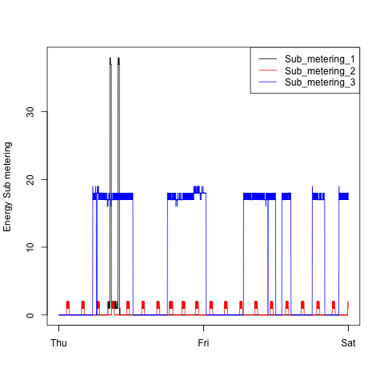
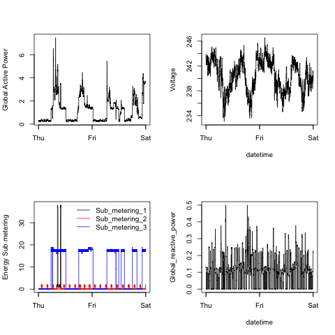

## Exploratory Data Analysis Plotting Project #1

This assignment uses data from
the <a href="http://archive.ics.uci.edu/ml/">UC Irvine Machine
Learning Repository</a>.

* <b>Dataset</b>: <a href="https://d396qusza40orc.cloudfront.net/exdata%2Fdata%2Fhousehold_power_consumption.zip">Electric power consumption</a> [20Mb]

* <b>Description</b>: Measurements of electric power consumption in
one household with a one-minute sampling rate over a period of almost
4 years. Different electrical quantities and some sub-metering values
are available.

The following descriptions of the 9 variables in the dataset are taken
from the <a href="https://archive.ics.uci.edu/ml/datasets/Individual+household+electric+power+consumption">UCI
web site</a>:

This variables are transformed in the script so they are computer redable. Variable 1 into date format, Variable 2 into POSIXct format and all other variables into numeric formats.

<ol>
<li><b>Date</b>: Date in format dd/mm/yyyy </li>
<li><b>Time</b>: time in format hh:mm:ss </li>
<li><b>Global_active_power</b>: household global minute-averaged active power (in kilowatt) </li>
<li><b>Global_reactive_power</b>: household global minute-averaged reactive power (in kilowatt) </li>
<li><b>Voltage</b>: minute-averaged voltage (in volt) </li>
<li><b>Global_intensity</b>: household global minute-averaged current intensity (in ampere) </li>
<li><b>Sub_metering_1</b>: energy sub-metering No. 1 (in watt-hour of active energy). It corresponds to the kitchen, containing mainly a dishwasher, an oven and a microwave (hot plates are not electric but gas powered). </li>
<li><b>Sub_metering_2</b>: energy sub-metering No. 2 (in watt-hour of active energy). It corresponds to the laundry room, containing a washing-machine, a tumble-drier, a refrigerator and a light. </li>
<li><b>Sub_metering_3</b>: energy sub-metering No. 3 (in watt-hour of active energy). It corresponds to an electric water-heater and an air-conditioner.</li>
</ol>

## Loading the data

When loading the variables into R they are transformed in the script so they are computer redable. Variable 1 into date format, Variable 2 into POSIXct format and all other variables into numeric formats.

## Results

The plots where made with the data from 20078-02-01 to 2007-02-02.

The followed this characteristics

* PNG file with a width of 480 pixels and a height of 480 pixels.

* Each plot was created using it's corresponding R script. For example `plot1.R` creates `plot1.png`.

The four plots created with the R code are shown below. 

### Plot 1

Histogram Frequency of Global Active Power

 

### Plot 2

Scatterplot Global Active Power (kilowatts) vs Time

 

### Plot 3

Scatterplot Energy Sub Metering 1, 2 & 3 vs Time

 

### Plot 4

Four Scatterplots 

* Global Active Power vs Time
* Voltage vs Time
* Energy Sub Metering vs Time
* Global Reactive Power vs Time

 

