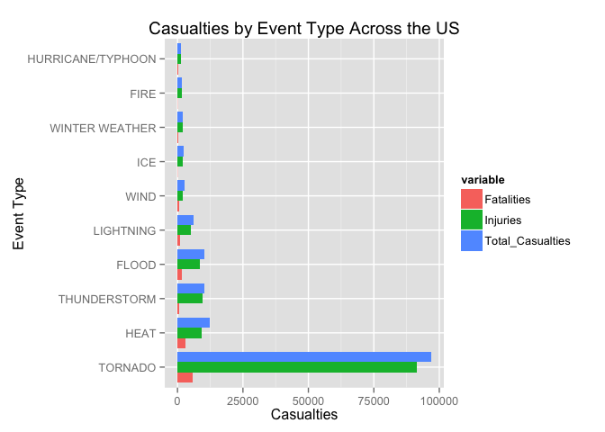
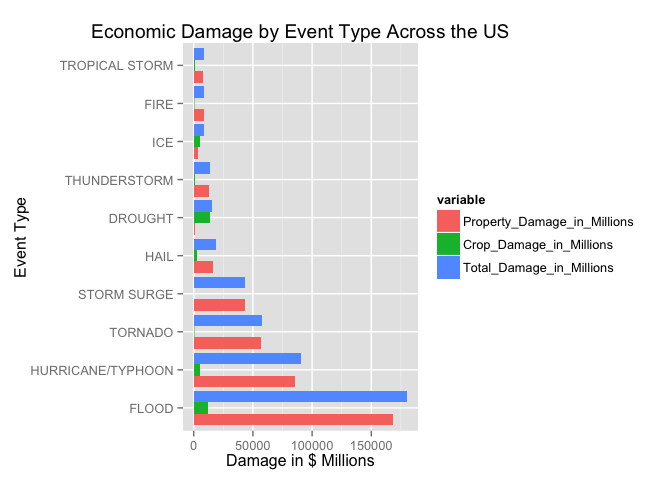

# Data Analysis of the NOAA Storm Data set to determine Weather Event's Economic and Public Health consequences
Allan R. Brewer Cappellin  
April, 25th 2015  

## Synopsis

This research is aimed to determine the consequence of different weather events on economical and public health across the United States. The data was obtained from a link in the course Reproducible Research in the Coursera Data Science Specialization. Originally this data comes from the NOAA Storm Database. This analysis will determine the consequences by Event Type. The public health consequences will be measured by fatalities and injuries. The economical consequences will be measured by cost of by property and crop damage. From the result obtained we can say that Tornadoes are the most dangerous events for public safety and floods for economic damage. In global Tornadoes are the most dangerous and unpredictable event of all.

## Downloading Data and Loading Packages

Data downloaded from the the web from this URL [Storm DataSet](https://d396qusza40orc.cloudfront.net/repdata%2Fdata%2FStormData.csv.bz2).


```r
download.file(url = "https://d396qusza40orc.cloudfront.net/repdata%2Fdata%2FStormData.csv.bz2", destfile = "./NOAA_StormData.csv.bz2")
```

### Loading Required Packages

Before loading the data to R and process the data set we must load/install the required packages for the Analysis.


```r
if (!require(dplyr)) { install.packages("dplyr") }
if (!require(ggplot2)) { install.packages("ggplot2") }
if (!require(reshape2)) { install.packages("reshape2") }
if (!require(knitr)) { install.packages("knitr") }
```

## Data Processing

In this section we will load the data and transform it so it can be used to do the analysis and report the results.

### Load Data into R

After loading the packages we load the data set to the Environment to star the analysis.


```r
stormdata <- read.csv(bzfile("./NOAA_StormData.csv.bz2"), stringsAsFactors = FALSE)
stormdata <- tbl_df(stormdata)
```

After loading the data into R we can star processing the data to do the analysis. The first thing we should do is print out the summary/structure of the data set to understand the variables contained in it.


```r
str(stormdata)
```

```
## Classes 'tbl_df', 'tbl' and 'data.frame':	902297 obs. of  37 variables:
##  $ STATE__   : num  1 1 1 1 1 1 1 1 1 1 ...
##  $ BGN_DATE  : chr  "4/18/1950 0:00:00" "4/18/1950 0:00:00" "2/20/1951 0:00:00" "6/8/1951 0:00:00" ...
##  $ BGN_TIME  : chr  "0130" "0145" "1600" "0900" ...
##  $ TIME_ZONE : chr  "CST" "CST" "CST" "CST" ...
##  $ COUNTY    : num  97 3 57 89 43 77 9 123 125 57 ...
##  $ COUNTYNAME: chr  "MOBILE" "BALDWIN" "FAYETTE" "MADISON" ...
##  $ STATE     : chr  "AL" "AL" "AL" "AL" ...
##  $ EVTYPE    : chr  "TORNADO" "TORNADO" "TORNADO" "TORNADO" ...
##  $ BGN_RANGE : num  0 0 0 0 0 0 0 0 0 0 ...
##  $ BGN_AZI   : chr  "" "" "" "" ...
##  $ BGN_LOCATI: chr  "" "" "" "" ...
##  $ END_DATE  : chr  "" "" "" "" ...
##  $ END_TIME  : chr  "" "" "" "" ...
##  $ COUNTY_END: num  0 0 0 0 0 0 0 0 0 0 ...
##  $ COUNTYENDN: logi  NA NA NA NA NA NA ...
##  $ END_RANGE : num  0 0 0 0 0 0 0 0 0 0 ...
##  $ END_AZI   : chr  "" "" "" "" ...
##  $ END_LOCATI: chr  "" "" "" "" ...
##  $ LENGTH    : num  14 2 0.1 0 0 1.5 1.5 0 3.3 2.3 ...
##  $ WIDTH     : num  100 150 123 100 150 177 33 33 100 100 ...
##  $ F         : int  3 2 2 2 2 2 2 1 3 3 ...
##  $ MAG       : num  0 0 0 0 0 0 0 0 0 0 ...
##  $ FATALITIES: num  0 0 0 0 0 0 0 0 1 0 ...
##  $ INJURIES  : num  15 0 2 2 2 6 1 0 14 0 ...
##  $ PROPDMG   : num  25 2.5 25 2.5 2.5 2.5 2.5 2.5 25 25 ...
##  $ PROPDMGEXP: chr  "K" "K" "K" "K" ...
##  $ CROPDMG   : num  0 0 0 0 0 0 0 0 0 0 ...
##  $ CROPDMGEXP: chr  "" "" "" "" ...
##  $ WFO       : chr  "" "" "" "" ...
##  $ STATEOFFIC: chr  "" "" "" "" ...
##  $ ZONENAMES : chr  "" "" "" "" ...
##  $ LATITUDE  : num  3040 3042 3340 3458 3412 ...
##  $ LONGITUDE : num  8812 8755 8742 8626 8642 ...
##  $ LATITUDE_E: num  3051 0 0 0 0 ...
##  $ LONGITUDE_: num  8806 0 0 0 0 ...
##  $ REMARKS   : chr  "" "" "" "" ...
##  $ REFNUM    : num  1 2 3 4 5 6 7 8 9 10 ...
```

From this summary and the [Storm Data Documentation](https://d396qusza40orc.cloudfront.net/repdata%2Fpeer2_doc%2Fpd01016005curr.pdf) we can detect the variables that will work for our analysis. The variables are:

- **EVTYPE:** this variable indicates the type of event.
- **FATALITIES:** this variables indicates the fatalities in the event.
- **INJURIES:** this variables indicates the injuries in the event.
- **PROPDMG:** this variables indicates the value of property damage in the event
- **PROPDMGEXP:** this variables indicates the exponent associated with the property damage Value
- **CROPDMG:** this variables indicates the value of crop damage in the event
- **CROPDMGEXP:** this variables indicates the exponent associated with the crop damage Value

Since the other variables in the data set are not used in the entire analysis we can subset the data to contain only the variables we need. We will use the dplyr package previously loaded for this step. We then print the first rows of the subset data.


```r
stormdata <- select(stormdata, EVTYPE, FATALITIES, INJURIES, PROPDMG, PROPDMGEXP, CROPDMG, CROPDMGEXP)
stormdata
```

```
## Source: local data frame [902,297 x 7]
## 
##     EVTYPE FATALITIES INJURIES PROPDMG PROPDMGEXP CROPDMG CROPDMGEXP
## 1  TORNADO          0       15    25.0          K       0           
## 2  TORNADO          0        0     2.5          K       0           
## 3  TORNADO          0        2    25.0          K       0           
## 4  TORNADO          0        2     2.5          K       0           
## 5  TORNADO          0        2     2.5          K       0           
## 6  TORNADO          0        6     2.5          K       0           
## 7  TORNADO          0        1     2.5          K       0           
## 8  TORNADO          0        0     2.5          K       0           
## 9  TORNADO          1       14    25.0          K       0           
## 10 TORNADO          0        0    25.0          K       0           
## ..     ...        ...      ...     ...        ...     ...        ...
```

This subset of data is what we will use for the analysis. First we have to check the EVTYPE variable to see if it is correctly defined and if all events are unified.


```r
events <- unique(stormdata$EVTYPE)
events
```

```
##   [1] "TORNADO"                        "TSTM WIND"                     
##   [3] "HAIL"                           "FREEZING RAIN"                 
##   [5] "SNOW"                           "ICE STORM/FLASH FLOOD"         
##   [7] "SNOW/ICE"                       "WINTER STORM"                  
##   [9] "HURRICANE OPAL/HIGH WINDS"      "THUNDERSTORM WINDS"            
##  [11] "RECORD COLD"                    "HURRICANE ERIN"                
##  [13] "HURRICANE OPAL"                 "HEAVY RAIN"                    
##  [15] "LIGHTNING"                      "THUNDERSTORM WIND"             
##  [17] "DENSE FOG"                      "RIP CURRENT"                   
##  [19] "THUNDERSTORM WINS"              "FLASH FLOOD"                   
##  [21] "FLASH FLOODING"                 "HIGH WINDS"                    
##  [23] "FUNNEL CLOUD"                   "TORNADO F0"                    
##  [25] "THUNDERSTORM WINDS LIGHTNING"   "THUNDERSTORM WINDS/HAIL"       
##  [27] "HEAT"                           "WIND"                          
##  [29] "LIGHTING"                       "HEAVY RAINS"                   
##  [31] "LIGHTNING AND HEAVY RAIN"       "FUNNEL"                        
##  [33] "WALL CLOUD"                     "FLOODING"                      
##  [35] "THUNDERSTORM WINDS HAIL"        "FLOOD"                         
##  [37] "COLD"                           "HEAVY RAIN/LIGHTNING"          
##  [39] "FLASH FLOODING/THUNDERSTORM WI" "WALL CLOUD/FUNNEL CLOUD"       
##  [41] "THUNDERSTORM"                   "WATERSPOUT"                    
##  [43] "EXTREME COLD"                   "HAIL 1.75)"                    
##  [45] "LIGHTNING/HEAVY RAIN"           "HIGH WIND"                     
##  [47] "BLIZZARD"                       "BLIZZARD WEATHER"              
##  [49] "WIND CHILL"                     "BREAKUP FLOODING"              
##  [51] "HIGH WIND/BLIZZARD"             "RIVER FLOOD"                   
##  [53] "HEAVY SNOW"                     "FREEZE"                        
##  [55] "COASTAL FLOOD"                  "HIGH WIND AND HIGH TIDES"      
##  [57] "HIGH WIND/BLIZZARD/FREEZING RA" "HIGH TIDES"                    
##  [59] "HIGH WIND AND HEAVY SNOW"       "RECORD COLD AND HIGH WIND"     
##  [61] "RECORD HIGH TEMPERATURE"        "RECORD HIGH"                   
##  [63] "HIGH WINDS HEAVY RAINS"         "HIGH WIND/ BLIZZARD"           
##  [65] "ICE STORM"                      "BLIZZARD/HIGH WIND"            
##  [67] "HIGH WIND/LOW WIND CHILL"       "HEAVY SNOW/HIGH"               
##  [69] "RECORD LOW"                     "HIGH WINDS AND WIND CHILL"     
##  [71] "HEAVY SNOW/HIGH WINDS/FREEZING" "LOW TEMPERATURE RECORD"        
##  [73] "AVALANCHE"                      "MARINE MISHAP"                 
##  [75] "WIND CHILL/HIGH WIND"           "HIGH WIND/WIND CHILL/BLIZZARD" 
##  [77] "HIGH WIND/WIND CHILL"           "HIGH WIND/HEAVY SNOW"          
##  [79] "HIGH TEMPERATURE RECORD"        "FLOOD WATCH/"                  
##  [81] "RECORD HIGH TEMPERATURES"       "HIGH WIND/SEAS"                
##  [83] "HIGH WINDS/HEAVY RAIN"          "HIGH SEAS"                     
##  [85] "SEVERE TURBULENCE"              "RECORD RAINFALL"               
##  [87] "RECORD SNOWFALL"                "RECORD WARMTH"                 
##  [89] "HEAVY SNOW/WIND"                "EXTREME HEAT"                  
##  [91] "WIND DAMAGE"                    "DUST STORM"                    
##  [93] "APACHE COUNTY"                  "SLEET"                         
##  [95] "HAIL STORM"                     "FUNNEL CLOUDS"                 
##  [97] "FLASH FLOODS"                   "DUST DEVIL"                    
##  [99] "EXCESSIVE HEAT"                 "THUNDERSTORM WINDS/FUNNEL CLOU"
## [101] "WINTER STORM/HIGH WIND"         "WINTER STORM/HIGH WINDS"       
## [103] "GUSTY WINDS"                    "STRONG WINDS"                  
## [105] "FLOODING/HEAVY RAIN"            "SNOW AND WIND"                 
## [107] "HEAVY SURF COASTAL FLOODING"    "HEAVY SURF"                    
## [109] "HEAVY PRECIPATATION"            "URBAN FLOODING"                
## [111] "HIGH SURF"                      "BLOWING DUST"                  
## [113] "URBAN/SMALL"                    "WILD FIRES"                    
## [115] "HIGH"                           "URBAN/SMALL FLOODING"          
## [117] "WATER SPOUT"                    "HIGH WINDS DUST STORM"         
## [119] "WINTER STORM HIGH WINDS"        "LOCAL FLOOD"                   
## [121] "WINTER STORMS"                  "MUDSLIDES"                     
## [123] "RAINSTORM"                      "SEVERE THUNDERSTORM"           
## [125] "SEVERE THUNDERSTORMS"           "SEVERE THUNDERSTORM WINDS"     
## [127] "THUNDERSTORMS WINDS"            "DRY MICROBURST"                
## [129] "FLOOD/FLASH FLOOD"              "FLOOD/RAIN/WINDS"              
## [131] "WINDS"                          "DRY MICROBURST 61"             
## [133] "THUNDERSTORMS"                  "FLASH FLOOD WINDS"             
## [135] "URBAN/SMALL STREAM FLOODING"    "MICROBURST"                    
## [137] "STRONG WIND"                    "HIGH WIND DAMAGE"              
## [139] "STREAM FLOODING"                "URBAN AND SMALL"               
## [141] "HEAVY SNOWPACK"                 "ICE"                           
## [143] "FLASH FLOOD/"                   "DOWNBURST"                     
## [145] "GUSTNADO AND"                   "FLOOD/RAIN/WIND"               
## [147] "WET MICROBURST"                 "DOWNBURST WINDS"               
## [149] "DRY MICROBURST WINDS"           "DRY MIRCOBURST WINDS"          
## [151] "DRY MICROBURST 53"              "SMALL STREAM URBAN FLOOD"      
## [153] "MICROBURST WINDS"               "HIGH WINDS 57"                 
## [155] "DRY MICROBURST 50"              "HIGH WINDS 66"                 
## [157] "HIGH WINDS 76"                  "HIGH WINDS 63"                 
## [159] "HIGH WINDS 67"                  "BLIZZARD/HEAVY SNOW"           
## [161] "HEAVY SNOW/HIGH WINDS"          "BLOWING SNOW"                  
## [163] "HIGH WINDS 82"                  "HIGH WINDS 80"                 
## [165] "HIGH WINDS 58"                  "FREEZING DRIZZLE"              
## [167] "LIGHTNING THUNDERSTORM WINDSS"  "DRY MICROBURST 58"             
## [169] "HAIL 75"                        "HIGH WINDS 73"                 
## [171] "HIGH WINDS 55"                  "LIGHT SNOW AND SLEET"          
## [173] "URBAN FLOOD"                    "DRY MICROBURST 84"             
## [175] "THUNDERSTORM WINDS 60"          "HEAVY RAIN/FLOODING"           
## [177] "THUNDERSTORM WINDSS"            "TORNADOS"                      
## [179] "GLAZE"                          "RECORD HEAT"                   
## [181] "COASTAL FLOODING"               "HEAT WAVE"                     
## [183] "FIRST SNOW"                     "FREEZING RAIN AND SLEET"       
## [185] "UNSEASONABLY DRY"               "UNSEASONABLY WET"              
## [187] "WINTRY MIX"                     "WINTER WEATHER"                
## [189] "UNSEASONABLY COLD"              "EXTREME/RECORD COLD"           
## [191] "RIP CURRENTS HEAVY SURF"        "SLEET/RAIN/SNOW"               
## [193] "UNSEASONABLY WARM"              "DROUGHT"                       
## [195] "NORMAL PRECIPITATION"           "HIGH WINDS/FLOODING"           
## [197] "DRY"                            "RAIN/SNOW"                     
## [199] "SNOW/RAIN/SLEET"                "WATERSPOUT/TORNADO"            
## [201] "WATERSPOUTS"                    "WATERSPOUT TORNADO"            
## [203] "URBAN/SMALL STREAM FLOOD"       "STORM SURGE"                   
## [205] "WATERSPOUT-TORNADO"             "WATERSPOUT-"                   
## [207] "TORNADOES, TSTM WIND, HAIL"     "TROPICAL STORM ALBERTO"        
## [209] "TROPICAL STORM"                 "TROPICAL STORM GORDON"         
## [211] "TROPICAL STORM JERRY"           "LIGHTNING THUNDERSTORM WINDS"  
## [213] "WAYTERSPOUT"                    "MINOR FLOODING"                
## [215] "LIGHTNING INJURY"               "URBAN/SMALL STREAM  FLOOD"     
## [217] "LIGHTNING AND THUNDERSTORM WIN" "THUNDERSTORM WINDS53"          
## [219] "URBAN AND SMALL STREAM FLOOD"   "URBAN AND SMALL STREAM"        
## [221] "WILDFIRE"                       "DAMAGING FREEZE"               
## [223] "THUNDERSTORM WINDS 13"          "SMALL HAIL"                    
## [225] "HEAVY SNOW/HIGH WIND"           "HURRICANE"                     
## [227] "WILD/FOREST FIRE"               "SMALL STREAM FLOODING"         
## [229] "MUD SLIDE"                      "LIGNTNING"                     
## [231] "FROST"                          "FREEZING RAIN/SNOW"            
## [233] "HIGH WINDS/"                    "THUNDERSNOW"                   
## [235] "FLOODS"                         "EXTREME WIND CHILLS"           
## [237] "COOL AND WET"                   "HEAVY RAIN/SNOW"               
## [239] "SMALL STREAM AND URBAN FLOODIN" "SMALL STREAM/URBAN FLOOD"      
## [241] "SNOW/SLEET/FREEZING RAIN"       "SEVERE COLD"                   
## [243] "GLAZE ICE"                      "COLD WAVE"                     
## [245] "EARLY SNOW"                     "SMALL STREAM AND URBAN FLOOD"  
## [247] "HIGH  WINDS"                    "RURAL FLOOD"                   
## [249] "SMALL STREAM AND"               "MUD SLIDES"                    
## [251] "HAIL 80"                        "EXTREME WIND CHILL"            
## [253] "COLD AND WET CONDITIONS"        "EXCESSIVE WETNESS"             
## [255] "GRADIENT WINDS"                 "HEAVY SNOW/BLOWING SNOW"       
## [257] "SLEET/ICE STORM"                "THUNDERSTORM WINDS URBAN FLOOD"
## [259] "THUNDERSTORM WINDS SMALL STREA" "ROTATING WALL CLOUD"           
## [261] "LARGE WALL CLOUD"               "COLD AIR FUNNEL"               
## [263] "GUSTNADO"                       "COLD AIR FUNNELS"              
## [265] "BLOWING SNOW- EXTREME WIND CHI" "SNOW AND HEAVY SNOW"           
## [267] "GROUND BLIZZARD"                "MAJOR FLOOD"                   
## [269] "SNOW/HEAVY SNOW"                "FREEZING RAIN/SLEET"           
## [271] "ICE JAM FLOODING"               "SNOW- HIGH WIND- WIND CHILL"   
## [273] "STREET FLOOD"                   "COLD AIR TORNADO"              
## [275] "SMALL STREAM FLOOD"             "FOG"                           
## [277] "THUNDERSTORM WINDS 2"           "FUNNEL CLOUD/HAIL"             
## [279] "ICE/SNOW"                       "TSTM WIND 51"                  
## [281] "TSTM WIND 50"                   "TSTM WIND 52"                  
## [283] "TSTM WIND 55"                   "HEAVY SNOW/BLIZZARD"           
## [285] "THUNDERSTORM WINDS 61"          "HAIL 0.75"                     
## [287] "THUNDERSTORM DAMAGE"            "THUNDERTORM WINDS"             
## [289] "HAIL 1.00"                      "HAIL/WINDS"                    
## [291] "SNOW AND ICE"                   "WIND STORM"                    
## [293] "SNOWSTORM"                      "GRASS FIRES"                   
## [295] "LAKE FLOOD"                     "PROLONG COLD"                  
## [297] "HAIL/WIND"                      "HAIL 1.75"                     
## [299] "THUNDERSTORMW 50"               "WIND/HAIL"                     
## [301] "SNOW AND ICE STORM"             "URBAN AND SMALL STREAM FLOODIN"
## [303] "THUNDERSTORMS WIND"             "THUNDERSTORM  WINDS"           
## [305] "HEAVY SNOW/SLEET"               "AGRICULTURAL FREEZE"           
## [307] "DROUGHT/EXCESSIVE HEAT"         "TUNDERSTORM WIND"              
## [309] "TROPICAL STORM DEAN"            "THUNDERTSORM WIND"             
## [311] "THUNDERSTORM WINDS/ HAIL"       "THUNDERSTORM WIND/LIGHTNING"   
## [313] "HEAVY RAIN/SEVERE WEATHER"      "THUNDESTORM WINDS"             
## [315] "WATERSPOUT/ TORNADO"            "LIGHTNING."                    
## [317] "WARM DRY CONDITIONS"            "HURRICANE-GENERATED SWELLS"    
## [319] "HEAVY SNOW/ICE STORM"           "RIVER AND STREAM FLOOD"        
## [321] "HIGH WIND 63"                   "COASTAL SURGE"                 
## [323] "HEAVY SNOW AND ICE STORM"       "MINOR FLOOD"                   
## [325] "HIGH WINDS/COASTAL FLOOD"       "RAIN"                          
## [327] "RIVER FLOODING"                 "SNOW/RAIN"                     
## [329] "ICE FLOES"                      "HIGH WAVES"                    
## [331] "SNOW SQUALLS"                   "SNOW SQUALL"                   
## [333] "THUNDERSTORM WIND G50"          "LIGHTNING FIRE"                
## [335] "BLIZZARD/FREEZING RAIN"         "HEAVY LAKE SNOW"               
## [337] "HEAVY SNOW/FREEZING RAIN"       "LAKE EFFECT SNOW"              
## [339] "HEAVY WET SNOW"                 "DUST DEVIL WATERSPOUT"         
## [341] "THUNDERSTORM WINDS/HEAVY RAIN"  "THUNDERSTROM WINDS"            
## [343] "THUNDERSTORM WINDS      LE CEN" "HAIL 225"                      
## [345] "BLIZZARD AND HEAVY SNOW"        "HEAVY SNOW AND ICE"            
## [347] "ICE STORM AND SNOW"             "HEAVY SNOW ANDBLOWING SNOW"    
## [349] "HEAVY SNOW/ICE"                 "BLIZZARD AND EXTREME WIND CHIL"
## [351] "LOW WIND CHILL"                 "BLOWING SNOW & EXTREME WIND CH"
## [353] "WATERSPOUT/"                    "URBAN/SMALL STREAM"            
## [355] "TORNADO F3"                     "FUNNEL CLOUD."                 
## [357] "TORNDAO"                        "HAIL 0.88"                     
## [359] "FLOOD/RIVER FLOOD"              "MUD SLIDES URBAN FLOODING"     
## [361] "TORNADO F1"                     "THUNDERSTORM WINDS G"          
## [363] "DEEP HAIL"                      "GLAZE/ICE STORM"               
## [365] "HEAVY SNOW/WINTER STORM"        "AVALANCE"                      
## [367] "BLIZZARD/WINTER STORM"          "DUST STORM/HIGH WINDS"         
## [369] "ICE JAM"                        "FOREST FIRES"                  
## [371] "THUNDERSTORM WIND G60"          "FROST\\FREEZE"                 
## [373] "THUNDERSTORM WINDS."            "HAIL 88"                       
## [375] "HAIL 175"                       "HVY RAIN"                      
## [377] "HAIL 100"                       "HAIL 150"                      
## [379] "HAIL 075"                       "THUNDERSTORM WIND G55"         
## [381] "HAIL 125"                       "THUNDERSTORM WINDS G60"        
## [383] "HARD FREEZE"                    "HAIL 200"                      
## [385] "THUNDERSTORM WINDS FUNNEL CLOU" "THUNDERSTORM WINDS 62"         
## [387] "WILDFIRES"                      "RECORD HEAT WAVE"              
## [389] "HEAVY SNOW AND HIGH WINDS"      "HEAVY SNOW/HIGH WINDS & FLOOD" 
## [391] "HAIL FLOODING"                  "THUNDERSTORM WINDS/FLASH FLOOD"
## [393] "HIGH WIND 70"                   "WET SNOW"                      
## [395] "HEAVY RAIN AND FLOOD"           "LOCAL FLASH FLOOD"             
## [397] "THUNDERSTORM WINDS 53"          "FLOOD/FLASH FLOODING"          
## [399] "TORNADO/WATERSPOUT"             "RAIN AND WIND"                 
## [401] "THUNDERSTORM WIND 59"           "THUNDERSTORM WIND 52"          
## [403] "COASTAL/TIDAL FLOOD"            "SNOW/ICE STORM"                
## [405] "BELOW NORMAL PRECIPITATION"     "RIP CURRENTS/HEAVY SURF"       
## [407] "FLASH FLOOD/FLOOD"              "EXCESSIVE RAIN"                
## [409] "RECORD/EXCESSIVE HEAT"          "HEAT WAVES"                    
## [411] "LIGHT SNOW"                     "THUNDERSTORM WIND 69"          
## [413] "HAIL DAMAGE"                    "LIGHTNING DAMAGE"              
## [415] "RECORD TEMPERATURES"            "LIGHTNING AND WINDS"           
## [417] "FOG AND COLD TEMPERATURES"      "OTHER"                         
## [419] "RECORD SNOW"                    "SNOW/COLD"                     
## [421] "FLASH FLOOD FROM ICE JAMS"      "TSTM WIND G58"                 
## [423] "MUDSLIDE"                       "HEAVY SNOW SQUALLS"            
## [425] "HEAVY SNOW/SQUALLS"             "HEAVY SNOW-SQUALLS"            
## [427] "ICY ROADS"                      "HEAVY MIX"                     
## [429] "SNOW FREEZING RAIN"             "LACK OF SNOW"                  
## [431] "SNOW/SLEET"                     "SNOW/FREEZING RAIN"            
## [433] "SNOW DROUGHT"                   "THUNDERSTORMW WINDS"           
## [435] "THUNDERSTORM WIND 60 MPH"       "THUNDERSTORM WIND 65MPH"       
## [437] "THUNDERSTORM WIND/ TREES"       "THUNDERSTORM WIND/AWNING"      
## [439] "THUNDERSTORM WIND 98 MPH"       "THUNDERSTORM WIND TREES"       
## [441] "TORRENTIAL RAIN"                "TORNADO F2"                    
## [443] "RIP CURRENTS"                   "HURRICANE EMILY"               
## [445] "HURRICANE GORDON"               "HURRICANE FELIX"               
## [447] "THUNDERSTORM WIND 59 MPH"       "THUNDERSTORM WINDS 63 MPH"     
## [449] "THUNDERSTORM WIND/ TREE"        "THUNDERSTORM DAMAGE TO"        
## [451] "THUNDERSTORM WIND 65 MPH"       "FLASH FLOOD - HEAVY RAIN"      
## [453] "THUNDERSTORM WIND."             "FLASH FLOOD/ STREET"           
## [455] "THUNDERSTORM WIND 59 MPH."      "HEAVY SNOW   FREEZING RAIN"    
## [457] "DAM FAILURE"                    "THUNDERSTORM HAIL"             
## [459] "HAIL 088"                       "THUNDERSTORM WINDSHAIL"        
## [461] "LIGHTNING  WAUSEON"             "THUDERSTORM WINDS"             
## [463] "ICE AND SNOW"                   "RECORD COLD/FROST"             
## [465] "STORM FORCE WINDS"              "FREEZING RAIN AND SNOW"        
## [467] "FREEZING RAIN SLEET AND"        "SOUTHEAST"                     
## [469] "HEAVY SNOW & ICE"               "FREEZING DRIZZLE AND FREEZING" 
## [471] "THUNDERSTORM WINDS AND"         "HAIL/ICY ROADS"                
## [473] "FLASH FLOOD/HEAVY RAIN"         "HEAVY RAIN; URBAN FLOOD WINDS;"
## [475] "HEAVY PRECIPITATION"            "TSTM WIND DAMAGE"              
## [477] "HIGH WATER"                     "FLOOD FLASH"                   
## [479] "RAIN/WIND"                      "THUNDERSTORM WINDS 50"         
## [481] "THUNDERSTORM WIND G52"          "FLOOD FLOOD/FLASH"             
## [483] "THUNDERSTORM WINDS 52"          "SNOW SHOWERS"                  
## [485] "THUNDERSTORM WIND G51"          "HEAT WAVE DROUGHT"             
## [487] "HEAVY SNOW/BLIZZARD/AVALANCHE"  "RECORD SNOW/COLD"              
## [489] "WET WEATHER"                    "UNSEASONABLY WARM AND DRY"     
## [491] "FREEZING RAIN SLEET AND LIGHT"  "RECORD/EXCESSIVE RAINFALL"     
## [493] "TIDAL FLOOD"                    "BEACH EROSIN"                  
## [495] "THUNDERSTORM WIND G61"          "FLOOD/FLASH"                   
## [497] "LOW TEMPERATURE"                "SLEET & FREEZING RAIN"         
## [499] "HEAVY RAINS/FLOODING"           "THUNDERESTORM WINDS"           
## [501] "THUNDERSTORM WINDS/FLOODING"    "THUNDEERSTORM WINDS"           
## [503] "HIGHWAY FLOODING"               "THUNDERSTORM W INDS"           
## [505] "HYPOTHERMIA"                    "FLASH FLOOD/ FLOOD"            
## [507] "THUNDERSTORM WIND 50"           "THUNERSTORM WINDS"             
## [509] "HEAVY RAIN/MUDSLIDES/FLOOD"     "MUD/ROCK SLIDE"                
## [511] "HIGH WINDS/COLD"                "BEACH EROSION/COASTAL FLOOD"   
## [513] "COLD/WINDS"                     "SNOW/ BITTER COLD"             
## [515] "THUNDERSTORM WIND 56"           "SNOW SLEET"                    
## [517] "DRY HOT WEATHER"                "COLD WEATHER"                  
## [519] "RAPIDLY RISING WATER"           "HAIL ALOFT"                    
## [521] "EARLY FREEZE"                   "ICE/STRONG WINDS"              
## [523] "EXTREME WIND CHILL/BLOWING SNO" "SNOW/HIGH WINDS"               
## [525] "HIGH WINDS/SNOW"                "EARLY FROST"                   
## [527] "SNOWMELT FLOODING"              "HEAVY SNOW AND STRONG WINDS"   
## [529] "SNOW ACCUMULATION"              "BLOWING SNOW/EXTREME WIND CHIL"
## [531] "SNOW/ ICE"                      "SNOW/BLOWING SNOW"             
## [533] "TORNADOES"                      "THUNDERSTORM WIND/HAIL"        
## [535] "FLASH FLOODING/FLOOD"           "HAIL 275"                      
## [537] "HAIL 450"                       "FLASH FLOOODING"               
## [539] "EXCESSIVE RAINFALL"             "THUNDERSTORMW"                 
## [541] "HAILSTORM"                      "TSTM WINDS"                    
## [543] "BEACH FLOOD"                    "HAILSTORMS"                    
## [545] "TSTMW"                          "FUNNELS"                       
## [547] "TSTM WIND 65)"                  "THUNDERSTORM WINDS/ FLOOD"     
## [549] "HEAVY RAINFALL"                 "HEAT/DROUGHT"                  
## [551] "HEAT DROUGHT"                   "NEAR RECORD SNOW"              
## [553] "LANDSLIDE"                      "HIGH WIND AND SEAS"            
## [555] "THUNDERSTORMWINDS"              "THUNDERSTORM WINDS HEAVY RAIN" 
## [557] "SLEET/SNOW"                     "EXCESSIVE"                     
## [559] "SNOW/SLEET/RAIN"                "WILD/FOREST FIRES"             
## [561] "HEAVY SEAS"                     "DUSTSTORM"                     
## [563] "FLOOD & HEAVY RAIN"             "?"                             
## [565] "THUNDERSTROM WIND"              "FLOOD/FLASHFLOOD"              
## [567] "SNOW AND COLD"                  "HOT PATTERN"                   
## [569] "PROLONG COLD/SNOW"              "BRUSH FIRES"                   
## [571] "SNOW\\COLD"                     "WINTER MIX"                    
## [573] "EXCESSIVE PRECIPITATION"        "SNOWFALL RECORD"               
## [575] "HOT/DRY PATTERN"                "DRY PATTERN"                   
## [577] "MILD/DRY PATTERN"               "MILD PATTERN"                  
## [579] "LANDSLIDES"                     "HEAVY SHOWERS"                 
## [581] "HEAVY SNOW AND"                 "HIGH WIND 48"                  
## [583] "LAKE-EFFECT SNOW"               "BRUSH FIRE"                    
## [585] "WATERSPOUT FUNNEL CLOUD"        "URBAN SMALL STREAM FLOOD"      
## [587] "SAHARAN DUST"                   "HEAVY SHOWER"                  
## [589] "URBAN FLOOD LANDSLIDE"          "HEAVY SWELLS"                  
## [591] "URBAN SMALL"                    "URBAN FLOODS"                  
## [593] "SMALL STREAM"                   "HEAVY RAIN/URBAN FLOOD"        
## [595] "FLASH FLOOD/LANDSLIDE"          "LANDSLIDE/URBAN FLOOD"         
## [597] "HEAVY RAIN/SMALL STREAM URBAN"  "FLASH FLOOD LANDSLIDES"        
## [599] "EXTREME WINDCHILL"              "URBAN/SML STREAM FLD"          
## [601] "TSTM WIND/HAIL"                 "Other"                         
## [603] "Record dry month"               "Temperature record"            
## [605] "Minor Flooding"                 "Ice jam flood (minor"          
## [607] "High Wind"                      "Tstm Wind"                     
## [609] "ROUGH SURF"                     "Wind"                          
## [611] "Heavy Surf"                     "Dust Devil"                    
## [613] "Wind Damage"                    "Marine Accident"               
## [615] "Snow"                           "Freeze"                        
## [617] "Snow Squalls"                   "Coastal Flooding"              
## [619] "Heavy Rain"                     "Strong Wind"                   
## [621] "COASTAL STORM"                  "COASTALFLOOD"                  
## [623] "Erosion/Cstl Flood"             "Heavy Rain and Wind"           
## [625] "Light Snow/Flurries"            "Wet Month"                     
## [627] "Wet Year"                       "Tidal Flooding"                
## [629] "River Flooding"                 "Damaging Freeze"               
## [631] "Beach Erosion"                  "Hot and Dry"                   
## [633] "Flood/Flash Flood"              "Icy Roads"                     
## [635] "High Surf"                      "Heavy Rain/High Surf"          
## [637] "Thunderstorm Wind"              "Rain Damage"                   
## [639] "Unseasonable Cold"              "Early Frost"                   
## [641] "Wintry Mix"                     "blowing snow"                  
## [643] "STREET FLOODING"                "Record Cold"                   
## [645] "Extreme Cold"                   "Ice Fog"                       
## [647] "Excessive Cold"                 "Torrential Rainfall"           
## [649] "Freezing Rain"                  "Landslump"                     
## [651] "Late-season Snowfall"           "Hurricane Edouard"             
## [653] "Coastal Storm"                  "Flood"                         
## [655] "HEAVY RAIN/WIND"                "TIDAL FLOODING"                
## [657] "Winter Weather"                 "Snow squalls"                  
## [659] "Strong Winds"                   "Strong winds"                  
## [661] "RECORD WARM TEMPS."             "Ice/Snow"                      
## [663] "Mudslide"                       "Glaze"                         
## [665] "Extended Cold"                  "Snow Accumulation"             
## [667] "Freezing Fog"                   "Drifting Snow"                 
## [669] "Whirlwind"                      "Heavy snow shower"             
## [671] "Heavy rain"                     "LATE SNOW"                     
## [673] "Record May Snow"                "Record Winter Snow"            
## [675] "Heavy Precipitation"            " COASTAL FLOOD"                
## [677] "Record temperature"             "Light snow"                    
## [679] "Late Season Snowfall"           "Gusty Wind"                    
## [681] "small hail"                     "Light Snow"                    
## [683] "MIXED PRECIP"                   "Black Ice"                     
## [685] "Mudslides"                      "Gradient wind"                 
## [687] "Snow and Ice"                   "Freezing Spray"                
## [689] "Summary Jan 17"                 "Summary of March 14"           
## [691] "Summary of March 23"            "Summary of March 24"           
## [693] "Summary of April 3rd"           "Summary of April 12"           
## [695] "Summary of April 13"            "Summary of April 21"           
## [697] "Summary August 11"              "Summary of April 27"           
## [699] "Summary of May 9-10"            "Summary of May 10"             
## [701] "Summary of May 13"              "Summary of May 14"             
## [703] "Summary of May 22 am"           "Summary of May 22 pm"          
## [705] "Heatburst"                      "Summary of May 26 am"          
## [707] "Summary of May 26 pm"           "Metro Storm, May 26"           
## [709] "Summary of May 31 am"           "Summary of May 31 pm"          
## [711] "Summary of June 3"              "Summary of June 4"             
## [713] "Summary June 5-6"               "Summary June 6"                
## [715] "Summary of June 11"             "Summary of June 12"            
## [717] "Summary of June 13"             "Summary of June 15"            
## [719] "Summary of June 16"             "Summary June 18-19"            
## [721] "Summary of June 23"             "Summary of June 24"            
## [723] "Summary of June 30"             "Summary of July 2"             
## [725] "Summary of July 3"              "Summary of July 11"            
## [727] "Summary of July 22"             "Summary July 23-24"            
## [729] "Summary of July 26"             "Summary of July 29"            
## [731] "Summary of August 1"            "Summary August 2-3"            
## [733] "Summary August 7"               "Summary August 9"              
## [735] "Summary August 10"              "Summary August 17"             
## [737] "Summary August 21"              "Summary August 28"             
## [739] "Summary September 4"            "Summary September 20"          
## [741] "Summary September 23"           "Summary Sept. 25-26"           
## [743] "Summary: Oct. 20-21"            "Summary: October 31"           
## [745] "Summary: Nov. 6-7"              "Summary: Nov. 16"              
## [747] "Microburst"                     "wet micoburst"                 
## [749] "Hail(0.75)"                     "Funnel Cloud"                  
## [751] "Urban Flooding"                 "No Severe Weather"             
## [753] "Urban flood"                    "Urban Flood"                   
## [755] "Cold"                           "Summary of May 22"             
## [757] "Summary of June 6"              "Summary August 4"              
## [759] "Summary of June 10"             "Summary of June 18"            
## [761] "Summary September 3"            "Summary: Sept. 18"             
## [763] "Coastal Flood"                  "coastal flooding"              
## [765] "Small Hail"                     "Record Temperatures"           
## [767] "Light Snowfall"                 "Freezing Drizzle"              
## [769] "Gusty wind/rain"                "GUSTY WIND/HVY RAIN"           
## [771] "Blowing Snow"                   "Early snowfall"                
## [773] "Monthly Snowfall"               "Record Heat"                   
## [775] "Seasonal Snowfall"              "Monthly Rainfall"              
## [777] "Cold Temperature"               "Sml Stream Fld"                
## [779] "Heat Wave"                      "MUDSLIDE/LANDSLIDE"            
## [781] "Saharan Dust"                   "Volcanic Ash"                  
## [783] "Volcanic Ash Plume"             "Thundersnow shower"            
## [785] "NONE"                           "COLD AND SNOW"                 
## [787] "DAM BREAK"                      "TSTM WIND (G45)"               
## [789] "SLEET/FREEZING RAIN"            "BLACK ICE"                     
## [791] "BLOW-OUT TIDES"                 "UNSEASONABLY COOL"             
## [793] "TSTM HEAVY RAIN"                "Gusty Winds"                   
## [795] "GUSTY WIND"                     "TSTM WIND 40"                  
## [797] "TSTM WIND 45"                   "TSTM WIND (41)"                
## [799] "TSTM WIND (G40)"                "TSTM WND"                      
## [801] "Wintry mix"                     " TSTM WIND"                    
## [803] "Frost"                          "Frost/Freeze"                  
## [805] "RAIN (HEAVY)"                   "Record Warmth"                 
## [807] "Prolong Cold"                   "Cold and Frost"                
## [809] "URBAN/SML STREAM FLDG"          "STRONG WIND GUST"              
## [811] "LATE FREEZE"                    "BLOW-OUT TIDE"                 
## [813] "Hypothermia/Exposure"           "HYPOTHERMIA/EXPOSURE"          
## [815] "Lake Effect Snow"               "Mixed Precipitation"           
## [817] "Record High"                    "COASTALSTORM"                  
## [819] "Snow and sleet"                 "Freezing rain"                 
## [821] "Gusty winds"                    "Blizzard Summary"              
## [823] "SUMMARY OF MARCH 24-25"         "SUMMARY OF MARCH 27"           
## [825] "SUMMARY OF MARCH 29"            "GRADIENT WIND"                 
## [827] "Icestorm/Blizzard"              "Flood/Strong Wind"             
## [829] "TSTM WIND AND LIGHTNING"        "gradient wind"                 
## [831] "Freezing drizzle"               "Mountain Snows"                
## [833] "URBAN/SMALL STRM FLDG"          "Heavy surf and wind"           
## [835] "Mild and Dry Pattern"           "COLD AND FROST"                
## [837] "TYPHOON"                        "HIGH SWELLS"                   
## [839] "HIGH  SWELLS"                   "VOLCANIC ASH"                  
## [841] "DRY SPELL"                      " LIGHTNING"                    
## [843] "BEACH EROSION"                  "UNSEASONAL RAIN"               
## [845] "EARLY RAIN"                     "PROLONGED RAIN"                
## [847] "WINTERY MIX"                    "COASTAL FLOODING/EROSION"      
## [849] "HOT SPELL"                      "UNSEASONABLY HOT"              
## [851] " TSTM WIND (G45)"               "TSTM WIND  (G45)"              
## [853] "HIGH WIND (G40)"                "TSTM WIND (G35)"               
## [855] "DRY WEATHER"                    "ABNORMAL WARMTH"               
## [857] "UNUSUAL WARMTH"                 "WAKE LOW WIND"                 
## [859] "MONTHLY RAINFALL"               "COLD TEMPERATURES"             
## [861] "COLD WIND CHILL TEMPERATURES"   "MODERATE SNOW"                 
## [863] "MODERATE SNOWFALL"              "URBAN/STREET FLOODING"         
## [865] "COASTAL EROSION"                "UNUSUAL/RECORD WARMTH"         
## [867] "BITTER WIND CHILL"              "BITTER WIND CHILL TEMPERATURES"
## [869] "SEICHE"                         "TSTM"                          
## [871] "COASTAL  FLOODING/EROSION"      "UNSEASONABLY WARM YEAR"        
## [873] "HYPERTHERMIA/EXPOSURE"          "ROCK SLIDE"                    
## [875] "ICE PELLETS"                    "PATCHY DENSE FOG"              
## [877] "RECORD COOL"                    "RECORD WARM"                   
## [879] "HOT WEATHER"                    "RECORD TEMPERATURE"            
## [881] "TROPICAL DEPRESSION"            "VOLCANIC ERUPTION"             
## [883] "COOL SPELL"                     "WIND ADVISORY"                 
## [885] "GUSTY WIND/HAIL"                "RED FLAG FIRE WX"              
## [887] "FIRST FROST"                    "EXCESSIVELY DRY"               
## [889] "SNOW AND SLEET"                 "LIGHT SNOW/FREEZING PRECIP"    
## [891] "VOG"                            "MONTHLY PRECIPITATION"         
## [893] "MONTHLY TEMPERATURE"            "RECORD DRYNESS"                
## [895] "EXTREME WINDCHILL TEMPERATURES" "MIXED PRECIPITATION"           
## [897] "DRY CONDITIONS"                 "REMNANTS OF FLOYD"             
## [899] "EARLY SNOWFALL"                 "FREEZING FOG"                  
## [901] "LANDSPOUT"                      "DRIEST MONTH"                  
## [903] "RECORD  COLD"                   "LATE SEASON HAIL"              
## [905] "EXCESSIVE SNOW"                 "DRYNESS"                       
## [907] "FLOOD/FLASH/FLOOD"              "WIND AND WAVE"                 
## [909] "LIGHT FREEZING RAIN"            " WIND"                         
## [911] "MONTHLY SNOWFALL"               "RECORD PRECIPITATION"          
## [913] "ICE ROADS"                      "ROUGH SEAS"                    
## [915] "UNSEASONABLY WARM/WET"          "UNSEASONABLY COOL & WET"       
## [917] "UNUSUALLY WARM"                 "TSTM WIND G45"                 
## [919] "NON SEVERE HAIL"                "NON-SEVERE WIND DAMAGE"        
## [921] "UNUSUALLY COLD"                 "WARM WEATHER"                  
## [923] "LANDSLUMP"                      "THUNDERSTORM WIND (G40)"       
## [925] "UNSEASONABLY WARM & WET"        " FLASH FLOOD"                  
## [927] "LOCALLY HEAVY RAIN"             "WIND GUSTS"                    
## [929] "UNSEASONAL LOW TEMP"            "HIGH SURF ADVISORY"            
## [931] "LATE SEASON SNOW"               "GUSTY LAKE WIND"               
## [933] "ABNORMALLY DRY"                 "WINTER WEATHER MIX"            
## [935] "RED FLAG CRITERIA"              "WND"                           
## [937] "CSTL FLOODING/EROSION"          "SMOKE"                         
## [939] " WATERSPOUT"                    "SNOW ADVISORY"                 
## [941] "EXTREMELY WET"                  "UNUSUALLY LATE SNOW"           
## [943] "VERY DRY"                       "RECORD LOW RAINFALL"           
## [945] "ROGUE WAVE"                     "PROLONG WARMTH"                
## [947] "ACCUMULATED SNOWFALL"           "FALLING SNOW/ICE"              
## [949] "DUST DEVEL"                     "NON-TSTM WIND"                 
## [951] "NON TSTM WIND"                  "GUSTY THUNDERSTORM WINDS"      
## [953] "PATCHY ICE"                     "HEAVY RAIN EFFECTS"            
## [955] "EXCESSIVE HEAT/DROUGHT"         "NORTHERN LIGHTS"               
## [957] "MARINE TSTM WIND"               "   HIGH SURF ADVISORY"         
## [959] "HAZARDOUS SURF"                 "FROST/FREEZE"                  
## [961] "WINTER WEATHER/MIX"             "ASTRONOMICAL HIGH TIDE"        
## [963] "WHIRLWIND"                      "VERY WARM"                     
## [965] "ABNORMALLY WET"                 "TORNADO DEBRIS"                
## [967] "EXTREME COLD/WIND CHILL"        "ICE ON ROAD"                   
## [969] "DROWNING"                       "GUSTY THUNDERSTORM WIND"       
## [971] "MARINE HAIL"                    "HIGH SURF ADVISORIES"          
## [973] "HURRICANE/TYPHOON"              "HEAVY SURF/HIGH SURF"          
## [975] "SLEET STORM"                    "STORM SURGE/TIDE"              
## [977] "COLD/WIND CHILL"                "MARINE HIGH WIND"              
## [979] "TSUNAMI"                        "DENSE SMOKE"                   
## [981] "LAKESHORE FLOOD"                "MARINE THUNDERSTORM WIND"      
## [983] "MARINE STRONG WIND"             "ASTRONOMICAL LOW TIDE"         
## [985] "VOLCANIC ASHFALL"
```

After inspecting the EVTYPE variable we must do some changes to the Variable so the analysis we will do is accurate.


```r
## All Event Types to capital Letters
stormdata$EVTYPE <- toupper(stormdata$EVTYPE)
## Remove all "Summary" Events from the data set
stormdata <- stormdata[!grepl("^SUMMARY", stormdata$EVTYPE), ]
## Eliminate multiple spaces at the start, the middle, or end of the Event name
stormdata$EVTYPE <- gsub("^ +", "", stormdata$EVTYPE)
stormdata$EVTYPE <- gsub("$ +", "", stormdata$EVTYPE)
stormdata$EVTYPE <- gsub(" +", " ", stormdata$EVTYPE)
## Unite all Thunderstorms events
stormdata[grepl("THUNDERSTORM", stormdata$EVTYPE), ]$EVTYPE <- "THUNDERSTORM"
stormdata[grepl("TSTM", stormdata$EVTYPE), ]$EVTYPE <- "THUNDERSTORM"
## Unite all Tornado events
stormdata[grepl("TORNADO", stormdata$EVTYPE), ]$EVTYPE <- "TORNADO"
## Unite all Wind events
stormdata[grepl("WIND", stormdata$EVTYPE), ]$EVTYPE <- "WIND"
## Unite all Heat/Dry events
stormdata[grepl("HEAT", stormdata$EVTYPE), ]$EVTYPE <- "HEAT"
stormdata[grepl("HOT", stormdata$EVTYPE), ]$EVTYPE <- "HEAT"
stormdata[grepl("HIGH TEMP", stormdata$EVTYPE), ]$EVTYPE <- "HEAT"
stormdata[grepl("WARM", stormdata$EVTYPE), ]$EVTYPE <- "HEAT"
stormdata[grepl("DRY", stormdata$EVTYPE), ]$EVTYPE <- "DRY"
## Unite all Wet events
stormdata[grepl("WET", stormdata$EVTYPE), ]$EVTYPE <- "WET"
## Unite all Snow/Ice/Cold events
stormdata[grepl("BLIZZARD", stormdata$EVTYPE), ]$EVTYPE <- "BLIZZARD"
stormdata[grepl("SNOW", stormdata$EVTYPE), ]$EVTYPE <- "SNOW"
stormdata[grepl("ICE", stormdata$EVTYPE), ]$EVTYPE <- "ICE"
stormdata[grepl("COLD", stormdata$EVTYPE), ]$EVTYPE <- "COLD"
stormdata[grepl("LOW TEMP", stormdata$EVTYPE), ]$EVTYPE <- "COLD"
stormdata[grepl("COOL", stormdata$EVTYPE), ]$EVTYPE <- "COOL"
stormdata[grepl("FREEZ", stormdata$EVTYPE), ]$EVTYPE <- "FREEZ"
stormdata[grepl("WINTER", stormdata$EVTYPE), ]$EVTYPE <- "WINTER WEATHER"
## Unite all Volcano events
stormdata[grepl("VOLCAN", stormdata$EVTYPE), ]$EVTYPE <- "VOLCANO"
## Unite all Flood events
stormdata[grepl("FLOOD", stormdata$EVTYPE), ]$EVTYPE <- "FLOOD"
## Unite all Rain/Hail events
stormdata[grepl("RAIN", stormdata$EVTYPE), ]$EVTYPE <- "RAIN"
stormdata[grepl("SHOWER", stormdata$EVTYPE), ]$EVTYPE <- "RAIN"
stormdata[grepl("PRECIP", stormdata$EVTYPE), ]$EVTYPE <- "RAIN"
stormdata[grepl("HAIL", stormdata$EVTYPE), ]$EVTYPE <- "HAIL"
## Unite all Lightning events
stormdata[grepl("LIGHTNING", stormdata$EVTYPE), ]$EVTYPE <- "LIGHTNING"
## Unite all Hurricane/Typhoon events
stormdata[grepl("HURRICANE", stormdata$EVTYPE), ]$EVTYPE <- "HURRICANE/TYPHOON"
stormdata[grepl("TYPHOON", stormdata$EVTYPE), ]$EVTYPE <- "HURRICANE/TYPHOON"
## Unite all Tropical Storm events
stormdata[grepl("TROPICAL", stormdata$EVTYPE), ]$EVTYPE <- "TROPICAL STORM"
## Unite all Surf events
stormdata[grepl("SURF", stormdata$EVTYPE), ]$EVTYPE <- "SURF"
stormdata[grepl("WAVE", stormdata$EVTYPE), ]$EVTYPE <- "SURF"
## Unite all Tidal events
stormdata[grepl("TIDE", stormdata$EVTYPE), ]$EVTYPE <- "TIDE"
## Unite all Fire/Smoke events
stormdata[grepl("FIRE", stormdata$EVTYPE), ]$EVTYPE <- "FIRE"
stormdata[grepl("SMOKE", stormdata$EVTYPE), ]$EVTYPE <- "SMOKE"
## Unite all Dust events
stormdata[grepl("DUST", stormdata$EVTYPE), ]$EVTYPE <- "DUST"
## Unite all Fog events
stormdata[grepl("FOG", stormdata$EVTYPE), ]$EVTYPE <- "FOG"
```

After my best effort to consolidate all event types into correctly spelled and into same types it was not possible to do a perfect job. But a great part of the events where reduces into one corresponding type, this will be enough since we only are concerned with the most occurring type of events. The results are as followed:


```r
events <- unique(stormdata$EVTYPE)
events
```

```
##   [1] "TORNADO"                 "THUNDERSTORM"           
##   [3] "HAIL"                    "FREEZ"                  
##   [5] "SNOW"                    "ICE"                    
##   [7] "WINTER WEATHER"          "WIND"                   
##   [9] "COLD"                    "HURRICANE/TYPHOON"      
##  [11] "RAIN"                    "LIGHTNING"              
##  [13] "FOG"                     "RIP CURRENT"            
##  [15] "FLOOD"                   "FUNNEL CLOUD"           
##  [17] "HEAT"                    "LIGHTING"               
##  [19] "FUNNEL"                  "WALL CLOUD"             
##  [21] "WALL CLOUD/FUNNEL CLOUD" "WATERSPOUT"             
##  [23] "BLIZZARD"                "TIDE"                   
##  [25] "RECORD HIGH"             "RECORD LOW"             
##  [27] "AVALANCHE"               "MARINE MISHAP"          
##  [29] "HIGH SEAS"               "SEVERE TURBULENCE"      
##  [31] "DUST"                    "APACHE COUNTY"          
##  [33] "SLEET"                   "FUNNEL CLOUDS"          
##  [35] "SURF"                    "URBAN/SMALL"            
##  [37] "FIRE"                    "HIGH"                   
##  [39] "WATER SPOUT"             "MUDSLIDES"              
##  [41] "DRY"                     "MICROBURST"             
##  [43] "URBAN AND SMALL"         "DOWNBURST"              
##  [45] "GUSTNADO AND"            "WET"                    
##  [47] "GLAZE"                   "WINTRY MIX"             
##  [49] "DROUGHT"                 "WATERSPOUTS"            
##  [51] "STORM SURGE"             "WATERSPOUT-"            
##  [53] "TROPICAL STORM"          "WAYTERSPOUT"            
##  [55] "URBAN AND SMALL STREAM"  "MUD SLIDE"              
##  [57] "LIGNTNING"               "FROST"                  
##  [59] "SMALL STREAM AND"        "MUD SLIDES"             
##  [61] "ROTATING WALL CLOUD"     "LARGE WALL CLOUD"       
##  [63] "GUSTNADO"                "COASTAL SURGE"          
##  [65] "WATERSPOUT/"             "URBAN/SMALL STREAM"     
##  [67] "FUNNEL CLOUD."           "TORNDAO"                
##  [69] "AVALANCE"                "RECORD TEMPERATURES"    
##  [71] "OTHER"                   "MUDSLIDE"               
##  [73] "ICY ROADS"               "HEAVY MIX"              
##  [75] "RIP CURRENTS"            "DAM FAILURE"            
##  [77] "SOUTHEAST"               "HIGH WATER"             
##  [79] "BEACH EROSIN"            "HYPOTHERMIA"            
##  [81] "MUD/ROCK SLIDE"          "RAPIDLY RISING WATER"   
##  [83] "EARLY FROST"             "FLASH FLOOODING"        
##  [85] "FUNNELS"                 "LANDSLIDE"              
##  [87] "EXCESSIVE"               "HEAVY SEAS"             
##  [89] "?"                       "MILD PATTERN"           
##  [91] "LANDSLIDES"              "WATERSPOUT FUNNEL CLOUD"
##  [93] "HEAVY SWELLS"            "URBAN SMALL"            
##  [95] "SMALL STREAM"            "URBAN/SML STREAM FLD"   
##  [97] "TEMPERATURE RECORD"      "MARINE ACCIDENT"        
##  [99] "COASTAL STORM"           "BEACH EROSION"          
## [101] "LANDSLUMP"               "RECORD TEMPERATURE"     
## [103] "METRO STORM, MAY 26"     "NO SEVERE WEATHER"      
## [105] "SML STREAM FLD"          "MUDSLIDE/LANDSLIDE"     
## [107] "VOLCANO"                 "NONE"                   
## [109] "DAM BREAK"               "COOL"                   
## [111] "URBAN/SML STREAM FLDG"   "HYPOTHERMIA/EXPOSURE"   
## [113] "COASTALSTORM"            "URBAN/SMALL STRM FLDG"  
## [115] "HIGH SWELLS"             "COASTAL EROSION"        
## [117] "SEICHE"                  "HYPERTHERMIA/EXPOSURE"  
## [119] "ROCK SLIDE"              "FIRST FROST"            
## [121] "VOG"                     "MONTHLY TEMPERATURE"    
## [123] "REMNANTS OF FLOYD"       "LANDSPOUT"              
## [125] "DRIEST MONTH"            "ROUGH SEAS"             
## [127] "RED FLAG CRITERIA"       "WND"                    
## [129] "SMOKE"                   "NORTHERN LIGHTS"        
## [131] "DROWNING"                "SLEET STORM"            
## [133] "TSUNAMI"
```

Now the next step in processing the data is to transform the Damage Variables into the correct units applying the Exponents from the DMGEXP Variable.

We first print the unique values for this variable to see its content


```r
## Symbols for the Property Damage Variable
propexpo <- unique(stormdata$PROPDMGEXP)
propexpo
```

```
##  [1] "K" "M" ""  "B" "m" "+" "0" "5" "6" "?" "4" "2" "3" "h" "7" "H" "-"
## [18] "1" "8"
```

```r
## Symbols for the Crop Damage Variable
cropexpo <- unique(stormdata$CROPDMGEXP)
cropexpo
```

```
## [1] ""  "M" "K" "m" "B" "?" "0" "k" "2"
```

We can determine from the documentation that the conversions are as follows:

- +/-/? = 0
- 1 = 1*10^1
- 2 = 1*10^2
- 3 = 1*10^3
- 4 = 1*10^4
- 5 = 1*10^5
- 6 = 1*10^6
- 7 = 1*10^7
- 8 = 1*10^8
- H/h = 100
- K/k = 1000
- M/m = 1000000
- B/b = 1000000000


```r
## Change the PROPDMGEXP Symbols into numbers
stormdata$PROPDMGEXP <- gsub("\\+|\\-|\\?", "0", stormdata$PROPDMGEXP)
stormdata$PROPDMGEXP <- gsub("1", "10", stormdata$PROPDMGEXP)
stormdata$PROPDMGEXP <- gsub("2", "100", stormdata$PROPDMGEXP)
stormdata$PROPDMGEXP <- gsub("3", "1000", stormdata$PROPDMGEXP)
stormdata$PROPDMGEXP <- gsub("4", "10000", stormdata$PROPDMGEXP)
stormdata$PROPDMGEXP <- gsub("5", "100000", stormdata$PROPDMGEXP)
stormdata$PROPDMGEXP <- gsub("6", "1000000", stormdata$PROPDMGEXP)
stormdata$PROPDMGEXP <- gsub("7", "10000000", stormdata$PROPDMGEXP)
stormdata$PROPDMGEXP <- gsub("8", "100000000", stormdata$PROPDMGEXP)
stormdata$PROPDMGEXP <- gsub("H|h", "100", stormdata$PROPDMGEXP)
stormdata$PROPDMGEXP <- gsub("K|k", "1000", stormdata$PROPDMGEXP)
stormdata$PROPDMGEXP <- gsub("M|m", "1000000", stormdata$PROPDMGEXP)
stormdata$PROPDMGEXP <- gsub("B|b", "1000000000", stormdata$PROPDMGEXP)
stormdata$PROPDMGEXP <- as.numeric(stormdata$PROPDMGEXP)
stormdata$PROPDMGEXP[is.na(stormdata$PROPDMGEXP)] = 0

## Change the CROPDMGEXP Symbols into numbers
stormdata$CROPDMGEXP <- gsub("\\+|\\-|\\?", "0", stormdata$CROPDMGEXP)
stormdata$CROPDMGEXP <- gsub("1", "10", stormdata$CROPDMGEXP)
stormdata$CROPDMGEXP <- gsub("2", "100", stormdata$CROPDMGEXP)
stormdata$CROPDMGEXP <- gsub("3", "1000", stormdata$CROPDMGEXP)
stormdata$CROPDMGEXP <- gsub("4", "10000", stormdata$CROPDMGEXP)
stormdata$CROPDMGEXP <- gsub("5", "100000", stormdata$CROPDMGEXP)
stormdata$CROPDMGEXP <- gsub("6", "1000000", stormdata$CROPDMGEXP)
stormdata$CROPDMGEXP <- gsub("7", "10000000", stormdata$CROPDMGEXP)
stormdata$CROPDMGEXP <- gsub("8", "100000000", stormdata$CROPDMGEXP)
stormdata$CROPDMGEXP <- gsub("H|h", "100", stormdata$CROPDMGEXP)
stormdata$CROPDMGEXP <- gsub("K|k", "1000", stormdata$CROPDMGEXP)
stormdata$CROPDMGEXP <- gsub("M|m", "1000000", stormdata$CROPDMGEXP)
stormdata$CROPDMGEXP <- gsub("B|b", "1000000000", stormdata$CROPDMGEXP)
stormdata$CROPDMGEXP <- as.numeric(stormdata$CROPDMGEXP)
stormdata$CROPDMGEXP[is.na(stormdata$CROPDMGEXP)] = 0
```

With the exponents transformed into values we can create new variables for the real Property and Crop Damage for each event. We will separate the data frame into two. One for the Public Health consequences analysis and another for the economic cost analysis.


```r
## Multiply the Damage Value by the exponent and divide by one million
stormdata <- mutate(stormdata, PROPDMG * PROPDMGEXP / 1000000, CROPDMG * CROPDMGEXP / 1000000)
## Eliminate the variables that are not longer needed
stormdata <- select(stormdata, -(PROPDMG:CROPDMGEXP))
names(stormdata) <- c("Event_Type", "Fatalities", "Injuries", "Property_Damage_in_Millions", "Crop_Damage_in_Millions")
## Separate the data set into the two independent tables
data.ph <- group_by(select(stormdata, Event_Type, Fatalities, Injuries), Event_Type)
data.ec <- group_by(select(stormdata, Event_Type, Property_Damage_in_Millions, Crop_Damage_in_Millions), Event_Type)
## We can remove the storm data that we will not longer use
rm(stormdata)
## We will add a total Variable for each of the tables
data.ph <- mutate(data.ph, Total_Casualties=Fatalities+Injuries)
data.ec <- mutate(data.ec, Total_Damage=Property_Damage_in_Millions+Crop_Damage_in_Millions)
```

With the data processed in the previous section we will produce various summary table to report the results in the next section and produce tables and figures.


```r
## Create Summary tables sum by event type
ph.sum <- arrange(summarize(data.ph, Fatalities = sum(Fatalities), Injuries = sum(Injuries), Total_Casualties = sum(Total_Casualties)), desc(Total_Casualties))
ec.sum <- arrange(summarize(data.ec, Property_Damage_in_Millions = sum(Property_Damage_in_Millions), Crop_Damage_in_Millions = sum(Crop_Damage_in_Millions), Total_Damage_in_Millions = sum(Total_Damage)), desc(Total_Damage_in_Millions))
## Create Summary Table max per events
ph.max <- arrange(summarize(data.ph, Max_Fatalities = max(Fatalities), Max_Injuries = max(Injuries), Max_Total_Casualties = max(Total_Casualties)), desc(Max_Total_Casualties))
ec.max <- arrange(summarize(data.ec, Max_Property_Damage_in_Millions = max(Property_Damage_in_Millions), Max_Crop_Damage_in_Millions = max(Crop_Damage_in_Millions), Max_Total_Damage_in_Millions = max(Total_Damage)), desc(Max_Total_Damage_in_Millions))
```


## Results

With the data we processed in the previous section we will report the results of the analysis.

### Part 1 - Consequences of event types in the public health

The results of the consequences of in public health by event type where calculated in the previous section. We will print the top events in a table to see the effect on Fatalities, Injuries and Total Casualties.


```r
## Print the Summatory Public Health Summary Table
kable(ph.sum[1:20,])
```


Event_Type           Fatalities   Injuries   Total_Casualties
------------------  -----------  ---------  -----------------
TORNADO                    5636      91407              97043
HEAT                       3178       9243              12421
THUNDERSTORM                754       9544              10298
FLOOD                      1525       8602              10127
LIGHTNING                   817       5231               6048
WIND                        698       1994               2692
ICE                          97       2154               2251
WINTER WEATHER              277       1876               2153
FIRE                         90       1608               1698
HURRICANE/TYPHOON           133       1333               1466
HAIL                         15       1371               1386
SNOW                        164       1122               1286
FOG                          80       1076               1156
BLIZZARD                    101        806                907
RIP CURRENT                 368        232                600
DUST                         24        483                507
COLD                        222        280                502
RIP CURRENTS                204        297                501
TROPICAL STORM               66        383                449
SURF                        164        248                412

```r
## Print the Max Public Health Summary Table
kable(ph.max[1:20,])
```


Event_Type           Max_Fatalities   Max_Injuries   Max_Total_Casualties
------------------  ---------------  -------------  ---------------------
TORNADO                         158           1700                   1742
ICE                               6           1568                   1569
FLOOD                            20            800                    802
HURRICANE/TYPHOON                15            780                    787
HEAT                            583            519                    583
BLIZZARD                          8            385                    390
TROPICAL STORM                   22            200                    201
SNOW                             14            185                    185
WINTER WEATHER                   10            165                    170
TSUNAMI                          32            129                    161
FIRE                             14            150                    153
COLD                              7            129                    132
HAIL                              4            109                    109
WIND                             10             89                     89
FOG                              11             78                     80
WINTRY MIX                        1             72                     72
THUNDERSTORM                     25             70                     70
GLAZE                             5             61                     61
SURF                             10             55                     55
LIGHTNING                         5             51                     51

Next we will print a plot with the summatory of Fatalities, Injuries and Total Casualties by the top ten event types.


```r
## Select only the top ten Events to be plotted
ph.sum.plot <- ph.sum[1:10,]
ph.sum.plot <- melt(ph.sum.plot, id.vars = "Event_Type")
## Create the plot
plot1 <- ggplot(ph.sum.plot, aes(x = reorder(Event_Type, desc(value)), y = value, fill = variable, group = variable))
plot1 <- plot1 + labs(title = "Casualties by Event Type Across the US", x = "Event Type", y = "Casualties")
plot1 <- plot1 + geom_bar(position = "dodge",stat = "identity") + coord_flip()
plot1
```

 

Plot 1. Bar Chart of Total Fatalities and Injuries by Event Type

#### Interpreting Results in Public Health

For the public health data there is a clear Event Type that causes the most casualties. This is the Tornado, it has causes a lot of injuries during the time span of the data collection and clearly it causes the most Deaths and Injuries. After the Tornado the next event is heat related, this involves high temperatures. Following are Thunderstorms, Floods and Lightning. The last event in the top ten are Hurricanes.

Regarding public health when preparing for events tornado should be the top priority in fund relocation.But given it is the most unpredictable is the most difficult to prepare for.

### Part 2 - Consequences of event types in the economy

The results of the consequences in economic terms by event type where calculated in the previous section. We will print the top events in a table to see the effect on Property Damage, Crop Damage and Total Damage.


```r
## Print the Summatory Public Health Summary Table
kable(ec.sum[1:20,])
```


Event_Type           Property_Damage_in_Millions   Crop_Damage_in_Millions   Total_Damage_in_Millions
------------------  ----------------------------  ------------------------  -------------------------
FLOOD                               168194.37332               12262.25910                180456.6324
HURRICANE/TYPHOON                    85256.41001                5506.11780                 90762.5278
TORNADO                              57003.31773                 414.96136                 57418.2791
STORM SURGE                          43323.53600                   0.00500                 43323.5410
HAIL                                 15977.04322                3046.83745                 19023.8807
DROUGHT                               1046.10600               13972.56600                 15018.6720
THUNDERSTORM                         12784.74743                1274.20890                 14058.9563
ICE                                   3964.27131                5027.11430                  8991.3856
FIRE                                  8496.62850                 403.28163                  8899.9101
TROPICAL STORM                        7716.12755                 694.89600                  8411.0235
WIND                                  6375.42899                 903.35055                  7278.7795
WINTER WEATHER                        6716.29525                  42.44400                  6758.7392
TIDE                                  4650.93300                   0.85000                  4651.7830
RAIN                                  3231.71219                 806.15280                  4037.8650
FREEZ                                   30.15950                1889.06100                  1919.2205
COLD                                   124.39140                1343.11550                  1467.5069
SNOW                                  1024.41974                 134.66310                  1159.0828
LIGHTNING                              935.40928                  12.09209                   947.5014
HEAT                                    20.32575                 904.47928                   924.8050
BLIZZARD                               664.86395                 112.06000                   776.9239

```r
## Print the Max Public Health Summary Table
kable(ec.max[1:20,])
```


Event_Type           Max_Property_Damage_in_Millions   Max_Crop_Damage_in_Millions   Max_Total_Damage_in_Millions
------------------  --------------------------------  ----------------------------  -----------------------------
FLOOD                                      115000.00                      5000.000                      115032.50
STORM SURGE                                 31300.00                         0.005                       31300.00
HURRICANE/TYPHOON                           16930.00                      1510.000                       16930.00
TROPICAL STORM                               5150.00                       200.000                        5150.00
ICE                                           360.00                      5000.000                        5000.50
WINTER WEATHER                               5000.00                        15.000                        5000.00
TIDE                                         4000.00                         0.750                        4000.00
TORNADO                                      2800.00                        70.000                        2800.00
RAIN                                         2500.00                       200.000                        2500.00
HAIL                                         1800.00                        70.000                        1800.00
THUNDERSTORM                                 1600.00                        50.000                        1602.50
FIRE                                         1500.00                        90.000                        1500.00
WIND                                         1300.00                       175.000                        1300.00
DROUGHT                                       645.15                      1000.000                        1000.00
COLD                                           50.00                       596.000                         596.00
HEAT                                            3.80                       492.400                         492.57
FREEZ                                           8.00                       286.000                         286.00
WET                                             0.02                       142.000                         142.00
BLIZZARD                                      102.00                        50.000                         102.00
SNOW                                           56.50                        65.000                          90.00

Next we will print a plot with the summatory of Property, Crop and Total Damage by the top ten Event Types.


```r
## Select only the top ten Events to be plotted
ec.sum.plot <- ec.sum[1:10,]
ec.sum.plot <- melt(ec.sum.plot, id.vars = "Event_Type")
## Create the plot
plot2 <- ggplot(ec.sum.plot, aes(x = reorder(Event_Type, desc(value)), y = value, fill = variable, group = variable))
plot2 <- plot2 + labs(title = "Economic Damage by Event Type Across the US", x = "Event Type", y = "Damage in $ Millions")
plot2 <- plot2 + geom_bar(position = "dodge",stat = "identity") + coord_flip()
plot2
```

 

Plot 2. Bar Chart of Total Property and Crop Damages by Event Type

#### Interpreting Results in Economic Damage

Regarding economic consequences from weather events clearly the most damaging are floods. They affect both crops and Property. The biggest part of the damages done during events are always regarding properties. From the other events are the Hurricanes, Tornadoes, and Storm Surge. The least damaging in the list of top ten are Tropical Storms.

### Final Results

After analyzing both the results from Public Health and Economic Damage we can conclude that the most dangerous and damaging are Tornadoes it causes both casualties and economic damage. As we mentioned before is one of the most difficult events to prepare for but it definitely requires the most attention.
