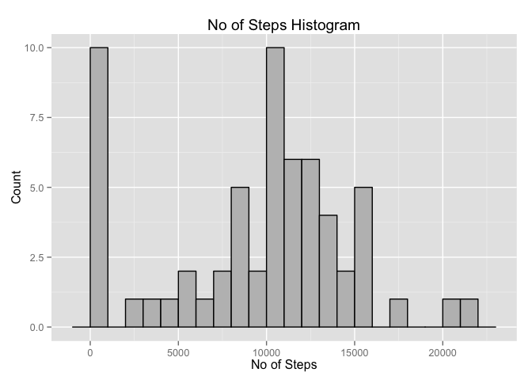
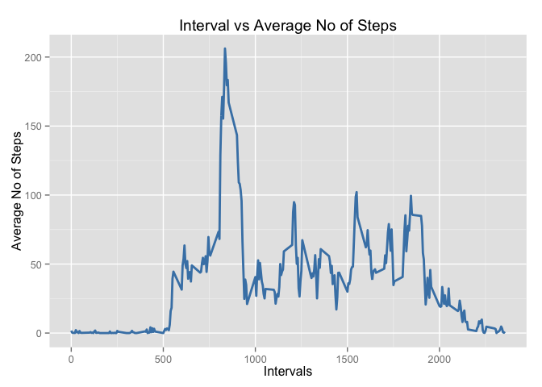
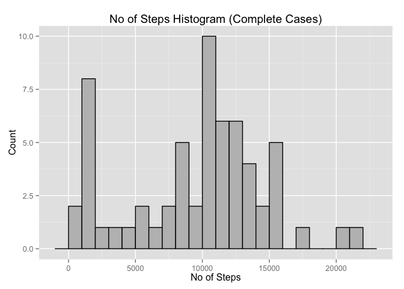
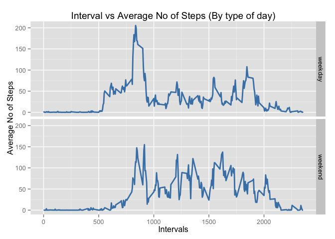

# Reproducible Research: Peer Assessment 1

This R Markdown document contains all the information and code for the Reproducible Research Course, Assignment #1. 
The assignment consists in reading a dataset that contains data from a personal activity monitor that collects the number of steps in intervals of 5 minutes. The data set is transformed and descriptive statistics are determined. 

Before reading the dataset and the calculations are made we load and install the required packages.


```r
if (!require(dplyr)) { install.packages("dplyr") }
```

```
## Loading required package: dplyr
## 
## Attaching package: 'dplyr'
## 
## The following object is masked from 'package:stats':
## 
##     filter
## 
## The following objects are masked from 'package:base':
## 
##     intersect, setdiff, setequal, union
```

```r
if (!require(ggplot2)) { install.packages("ggplot2") }
```

```
## Loading required package: ggplot2
```

## Loading and preprocessing the data

The first step in the analysis is loading the Raw data and making the necessary adjustments.


```r
## Read the data
activity.data <- read.csv(file = "./activity.csv", colClasses = c("numeric", "Date", "numeric"))
activity.data <- tbl_df(activity.data)
## Output the summary of the dataset
summary(activity.data)
```

```
##      steps             date               interval     
##  Min.   :  0.00   Min.   :2012-10-01   Min.   :   0.0  
##  1st Qu.:  0.00   1st Qu.:2012-10-16   1st Qu.: 588.8  
##  Median :  0.00   Median :2012-10-31   Median :1177.5  
##  Mean   : 37.38   Mean   :2012-10-31   Mean   :1177.5  
##  3rd Qu.: 12.00   3rd Qu.:2012-11-15   3rd Qu.:1766.2  
##  Max.   :806.00   Max.   :2012-11-30   Max.   :2355.0  
##  NA's   :2304
```


## What is mean total number of steps taken per day?

In this section we will determine the number of steps per day, make a histogram of the number of steps and calculate the mean and median.

The first step is to determine the number of steps per day in the data. I use the dplyr package for this.


```r
## I group the data by date
activity.data.date <- group_by(activity.data, date)
## Calculate the total number of steps for each day
step.summary <- summarise(activity.data.date, sum(steps, na.rm = TRUE))
names(step.summary) <- c("day", "steps")
```

Second step is to make and print a histogram of the total number of steps. For this I use the ggplot2 package.


```r
plot1 <- ggplot(step.summary, aes(x = steps))
plot1 <- plot1 + geom_histogram(binwidth = 1000, color = "black", fill = "gray") 
plot1 <- plot1 + labs(title = "No of Steps Histogram", x = "No of Steps", y = "Count")
print(plot1)
```

 

The last step of this section is to calculate the Mean and Median for the total number of steps per day.


```r
## Print the summarized data by day
## print.data.frame(step.summary)
## I use the mean and median function to calculate and report the mean and median from the summary table.
list("Average Steps per Day" = mean(step.summary$steps, na.rm = TRUE))
```

```
## $`Average Steps per Day`
## [1] 9354.23
```

```r
list("Median Steps per Day" = median(step.summary$steps, na.rm = TRUE))
```

```
## $`Median Steps per Day`
## [1] 10395
```

## What is the average daily activity pattern?

For this section we will make a plot and determine the maximum number of steps based on the 5 minute intervals.

The first step is to summarize the data by intervals and create the time series plot. I use the dplyr and ggplot2 package.


```r
## Group and summarize the data by interval
activity.data.interval <- group_by(activity.data, interval)
interval.summary <- summarise(activity.data.interval, mean(steps, na.rm = TRUE))
names(interval.summary) <- c("interval","average_steps")
```

After summarizing the data by intervals and determining the mean for each interval for across all days we create the plot.


```r
## Make and print the plot
plot2 <- ggplot(interval.summary, aes(x = interval, y = average_steps))
plot2 <- plot2 + geom_line(size = 1, color = "steelblue")
plot2 <- plot2 + labs(title = "Interval vs Average No of Steps", x = "Intervals", y = "Average No of Steps")
print(plot2)
```

 

In the next step we determine the interval with the maximum number steps in average.


```r
## Determine what is the maximum value of steps
max.steps <- max(interval.summary$average_steps)
## Filter the data frame to extract the row with the max average number of steps
filter(interval.summary, average_steps == max.steps)[1]
```

```
## Source: local data frame [1 x 1]
## 
##   interval
## 1      835
```

## Imputing missing values

This section is dedicated to missing values (NAs) and the impact filling this values have on the values determined in the second section.

First we calculate the number of rows that contain missing values.


```r
## Number of rows with NAs
list("Incomplete Cases" = sum(!complete.cases(activity.data)))
```

```
## $`Incomplete Cases`
## [1] 2304
```

After determining the number of incomplete cases a strategy is devised to input values and fill the NAs. 

The strategy to use is the median of the 5 minute interval of the missing value. By using the median we make sure that outliers do not have influence over the value imputed. We can see from the summary of the original activity data set that there are outliers in the steps variable. The median is 0 and the mean is 37.38, that mean that the steps variable is rigth-skewed and since the maximun value is 806 it has some large outliers.

With the strategy established we determine the median steps for each interval and replace the missing values.


```r
## Determine the median for each 5 minute interval removing the NAs 
interval.summary.median <- summarise(activity.data.interval, median(steps, na.rm = TRUE))
names(interval.summary.median) <- c("interval","median_steps")
## Determine which are the incomplete cases
incomp.cases <- which(!complete.cases(activity.data))
## Create a copy of activity data to input the values for NAs
activity.data.comp <- activity.data
## Do a for loop for each incomplete case, imputing the value of the median for the interval of the missing value.
for (i in incomp.cases) {
	int <- activity.data$interval[i]
	val <- filter(interval.summary.median, interval == int)[[2]]
	activity.data.comp$steps[i] <- val
}
summary(activity.data.comp)
```

```
##      steps          date               interval     
##  Min.   :  0   Min.   :2012-10-01   Min.   :   0.0  
##  1st Qu.:  0   1st Qu.:2012-10-16   1st Qu.: 588.8  
##  Median :  0   Median :2012-10-31   Median :1177.5  
##  Mean   : 33   Mean   :2012-10-31   Mean   :1177.5  
##  3rd Qu.:  8   3rd Qu.:2012-11-15   3rd Qu.:1766.2  
##  Max.   :806   Max.   :2012-11-30   Max.   :2355.0
```

After imputing the missing values we calculate the total number of steps for each day.


```r
## I group the data by date
activity.data.comp.date <- group_by(activity.data.comp, date)
## Calculate the total number of steps
step.summary.comp <- summarise(activity.data.comp.date, sum(steps, na.rm = TRUE))
names(step.summary.comp) <- c("day", "steps")
```

After creating the summary table with the number of steps per day we make a histogram with this information and compare it to the first plot that contained the missing values.


```r
plot3 <- ggplot(step.summary.comp, aes(x = steps))
plot3 <- plot3 + geom_histogram(binwidth = 1000, color = "black", fill = "gray") 
plot3 <- plot3 + labs(title = "No of Steps Histogram (Complete Cases)", x = "No of Steps", y = "Count")
print(plot3)
```

 

Besides comparing the histogram we print out the mean and media per day and compare to the original data set with the NAs.


```r
## Print the summarized data by day
## print.data.frame(step.summary.comp)
## I use the mean and median function to calculate and report the mean and median from the summary table.
list("Average Steps per Day" = mean(step.summary.comp$steps, na.rm = TRUE))
```

```
## $`Average Steps per Day`
## [1] 9503.869
```

```r
list("Median Steps per Day" = median(step.summary.comp$steps, na.rm = TRUE))
```

```
## $`Median Steps per Day`
## [1] 10395
```

After comparing the histograms and the mean and median we see that imputing the data adds to the numbers of steps per day as expected. In the histogram we can appreciate as the data moves to the right since more steps are taken each day.

In the mean and media case, the mean increments as the number of steps taken each day rises by imputing the data. The median on the other hand does not differ from the first value calculated. This is because data is modified in the data set but the middle value was not.

## Are there differences in activity patterns between weekdays and weekends?

For the last section of the assignment we must make two plots to compare the activity pattern between weekdays and weekends. This part is made using the dplyr and ggplot2 packages to manipulate the data and add the weekdays factor variable.


```r
## Add the variables Weekday and Weekend to the data set
activity.data.comp <- mutate(activity.data.comp, Weekday = weekdays(date))
activity.data.comp <- mutate(activity.data.comp, Weekend = grepl("Saturday|Sunday", Weekday))
activity.data.comp$Weekend <- as.factor(ifelse(activity.data.comp$Weekend, "weekend", "weekday"))
## Group the new data set by interval and Weekend Variables
activity.data.comp.interval <- group_by(activity.data.comp, interval, Weekend)
interval.weekend.summary.comp <- summarise(activity.data.comp.interval, mean(steps, na.rm = TRUE))
names(interval.weekend.summary.comp) <- c("interval", "weekend", "average_steps")
```

After manipulating the data and creating the weekend factor variable we can plot the information in two facets. The plot will represent the average number of steps per interval during weekdays and weekends.


```r
## Make and print the plot
plot4 <- ggplot(interval.weekend.summary.comp, aes(x = interval, y = average_steps))
plot4 <- plot4 + geom_line(size = 1, color = "steelblue") + facet_grid(weekend ~ .)
plot4 <- plot4 + labs(title = "Interval vs Average No of Steps (By type of day)", x = "Intervals", y = "Average No of Steps")
print(plot4)
```

 

Comparing both graphics in the panel we can determine that there is a difference in the activity pattern between weekdays and weekends. We can see that weekdays have more average activity in the early hours of the day compared to the weekends. On the other hand weekends have a higher average activity during the entire day.
